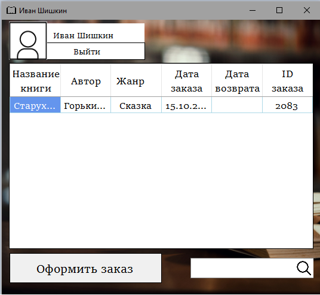
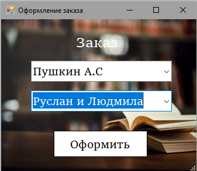
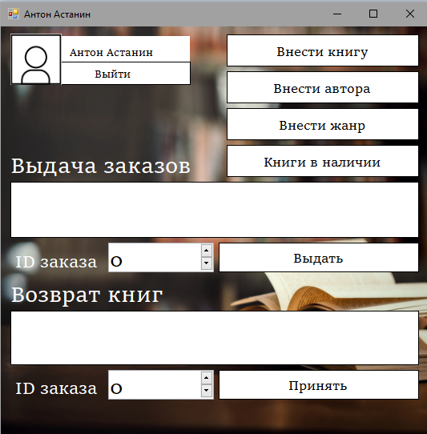
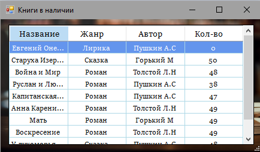

# Библиотечная система управления заказами

## Описание

Приложение для автоматизации работы библиотеки с разделением ролей на читателей и библиотекарей. Система позволяет читателям оформлять заказы на книги, а библиотекарям - управлять выдачей и возвратом книг, а также пополнять каталог библиотеки.

## Технологический стек

**Frontend:**
- Windows Forms (.NET Framework)
- C#
- Entity Framework

**Backend:**
- .NET Framework
- C#
- SQL Server / LocalDB

**База данных:**
- MS SQL Server
- Entity Framework ORM

## Функциональность

### Для читателей:
- 📚 Авторизация в системе
- 👤 Регистрация нового аккаунта
- 📖 Просмотр доступных книг
- 🛒 Оформление заказов на книги
- 🔍 Поиск по каталогу (название, автор, жанр)
- 👤 Управление профилем
- 🔐 Смена пароля

### Для библиотекарей:
- 👥 Управление заказами читателей
- 📦 Выдача книг читателям
- 🔄 Прием возвращенных книг
- 📖 Добавление новых книг в каталог
- ✍️ Добавление новых авторов
- 🏷️ Добавление новых жанров

## Интерфейс

### Окно авторизации

### Главное окно читателя

### Оформление заказа

### Главное окно библиотекаря

### Управление книгами

